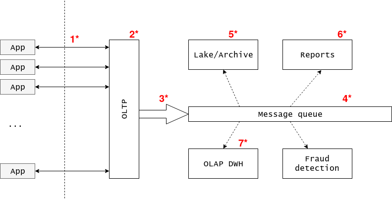
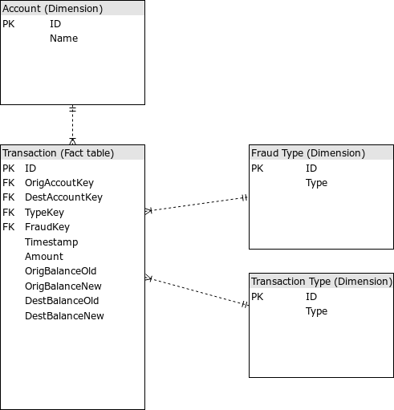
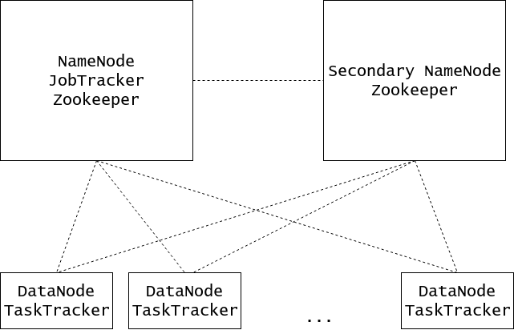

# Paysim

Paysim dataset is available at <https://www.kaggle.com/ntnu-testimon/paysim1/data>. Below is the data platform architecture design considerations for it.

## High level design

As the data is financial transactions is a must here (there is even such term in financial world). I have two possible options of doing it:

 1. First one is have OLTP database as a gatekeeper for whole system -- it will ensure no declined transactions are allowed in. Here by 'declined' I mean pure technical reason, such as competing transactions for, say, one account. It has nothing to do to with transaction being declined by, for example, financial institution because of fraud. After transaction is accepted it's fed into message queue for other consumers.
 1. Second one is directly put transaction (which could consist of multiple rows/entries) into message queue and have one high priority consumer listening for them and working with the OLTP database. In case transaction is declined, another message is put into the queue reverting previous one. This is the fallback option when first suggestion is not the option.

Message queue allows us to separate concerns and postpone data-processing tasks. For analytical datawarehouse task we will have one consumer that is triggered with some period, reads the data for the previous period (say, 1 hour) and processes/aggregates the data and puts it into OLAP database. For reports generation purposes, where one needs quickly locate particular data records another consumer watches for new data arrival and reroutes the data to another store.

This solution allows one to quickly add more consumers/sinks for the data. One example is near real-time fraud detection algorithm. Another advantage is to share the workload and allow fine tuning different parts for specific tasks and performance requirements.

.

Now, let's step to concrete tools and solutions (marked on the diagram as red numbers with asterisks).

I'd like to note that utilizing message queue as a mediator, cloud solutions could be employed as well.

 1. Application API calls to database (language of choice)
 1. OLTP database: Microsoft SQL if allowed, PostgreSQL/MySQL if open-source is a requirement, NewSQL guys (CockroachDB/TiDB) if brave, VoltDB.
 1. The way data flows from operational database to message queue. Two possible options I'd like to suggest. First one lets decouple from application API - operate on transaction log of the database. That is, once transaction is commited get notified and extract last information to write to the message queue (mq producer). Another option (if first one is technically not feasible) to maintain log table in the database and use stored procedures to simultaneously append transactions with operation table change.
 1. **Kafka**. Other possible options is to have some ETL framework/solution to deliver data from operational database to other sources. Examples could be batched ones like Informatica ETL and Microsoft SSIS, stream-oriented like Apache Flume, Apache Storm (both with the help of Apache Airflow or other orchestrating tool) and probably dozens of others I'm not aware of.
 1. Distributed filesystem - **HDFS**, Ceph, S3/Glacier, GFS. Stored as compressed files: gzipped csv or in ORC/Avro/Parquet format.
 1. Yandex **ClickHouse**, MailRU Tarantool, HyPer, VoltDB. It would effectively by the copy of operational DB log table. Those next generation in-memory databases which claim to be Hybrid DBMS.
 1. OLAP database could be read as database with columnar store engine. HBase as open source version of Google BigTable. Actually, **ClickHouse** is also a good fit here. But Microsoft SSAS is still strong candidate here. Another good open source option is Postgres tuned for OLAP (well, depending on scale). Apache HAWQ (easily integrate with hdfs and Avro/Parquet files), Greenplum.

## Streaming data processing

Here we assume the data is somehow delivered to us from operational database transaction log. So the task is to put the data into our system. According to previous choice (3rd and 4th points on the diagram) it's translated to write a Kafka producer code. However, Kafka has Connenctor API that could be used for this task as well.

```
# download data
unzip PS_20174392719_1491204439457_log.csv.zip
head -n10000 PS_20174392719_1491204439457_log.csv > PS_20174392719_1491204439457_log_10k.csv

# run kafka
cd task2/
git@github.com:wurstmeister/kafka-docker.git
cd kafka-docker/
# first, change IP in docker-compose-single-broker for docker host address (ex, 172.17.0.1)
docker-compose -f docker-compose-single-broker.yml up -d
cd ../

# install kafka python client
virtualenv .venv/
source .venv/bin/activate
pip install kafka-python
python3 producer.py

# check output with kafkacat
docker run --rm -it ryane/kafkacat -C -b 172.17.0.1:9092 -t test
```

## Datawarehouse



Corresponding DDL statements assume (for simplicity) Postgres is our OLAP database of choice.

```
# run Postgres
docker run --name postgresql -it --restart always \
  --publish 5432:5432 \
  --env 'DB_NAME=test' \
  --env 'DB_USER=dbuser' --env 'DB_PASS=secret' \
  --volume /srv/docker/postgresql:/var/lib/postgresql \
  sameersbn/postgresql:9.6-2

# Perform DDL and ETL
cd task3/
virtualenv .venv/
source .venv/bin/activate
pip install psycopg2 pandas

# Create tables
python ddl.py

# Perform ETL
python etl.py
```


## Hadoop implementation

Hadoop is essentially HDFS (storage) + MapReduce (compute). We will need to store 2.5M transaction per day.

```
$ spark-shell
scala> val df = spark.read.format("csv").option("header", "true").option("inferSchema", "true").load("../PS_20174392719_1491204439457_log.csv")
scala> df.format("parquet").option("compression", "gzip").save("transactions")
scala> :quit
$ ll transactions
Permissions Size User Date Modified Name
.rw-r--r--     0 ramp 20 Jan 15:08  _SUCCESS
.rw-r--r--   45M ramp 20 Jan 15:08  part-00000-f432dc30-41a8-4530-a377-e356989863d8-c000.gz.parquet
.rw-r--r--   45M ramp 20 Jan 15:08  part-00001-f432dc30-41a8-4530-a377-e356989863d8-c000.gz.parquet
.rw-r--r--   45M ramp 20 Jan 15:08  part-00002-f432dc30-41a8-4530-a377-e356989863d8-c000.gz.parquet
.rw-r--r--   44M ramp 20 Jan 15:08  part-00003-f432dc30-41a8-4530-a377-e356989863d8-c000.gz.parquet
```

So, for given data which is 6,362,621 transactions equals 180M of data. We will assume 2.5M transaction daily require 71M of storage, 1 year of transaction data then require 71M * 365 requires 25G of storage.

Hadoop by default has 3x replication ratio, so, storage capacity triples to 75G. Taking into account that we will need extra space for intermediate MapReduce results (materialization), we will reserve 25% capacity (see Dell-Cloudera reference architecture). Total storage requirements then become 75 / (1 - 0.25) = 100G.

100G per year. 1TB per 10 years.

Let's assume (to make numbers look significant) we have 30% yearly growth, then for 10 years 1.34TB (100G * 1.3 ^ 10) of storage space will be needed. How about 5-6 AWS H1 instances (up to 16TB of storage each)? Should be enough in terms of space. Those also come with 32/64/128/256 RAM in case one wants to share cluster resources with compute-intensive applications, like Spark.

For master nodes, there is no storage requirements so almost any decent configutartion would suffice.



## Spark Job

```
cd task5/
sbt package
/opt/apache-spark/bin/spark-submit --class 'TaskN5' --master 'local[4]' target/scala-2.11/task-5_2.11-1.0.jar ../PS_20174392719_1491204439457_log.csv
```

This spark job will:

 1. Calculate each account total payments and save into csv file (not merged, i.e. partitioned)
 1. Show 10 most active accounts

## Fast Searching Engine

Using Yandex Clickhouse.

```
# run server
cd task6/
# install clickhouse bindings
virtualenv .venv/
source .venv/bin/activate
pip install clickhouse-driver

# run server
docker run -d --name test --ulimit nofile=262144:262144 yandex/clickhouse-server

# run ingestion
python task6/ingest.py
```
